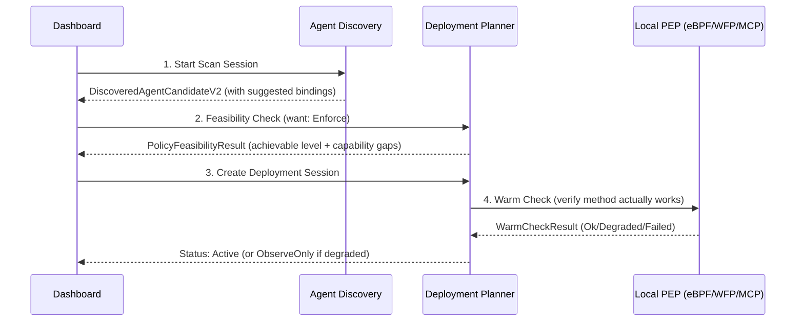

# Pollek Local Enforcement Kit — Architecture

Pollek Local Enforcement Kit is a Rust **Policy Enforcement Point (PEP)** with a local **Policy
Decision Point (PDP)**, built as a multi-crate workspace. It enforces signed
policy bundles produced by a control plane — either the local-first **Local
Control Plane** or **Pollek Cloud** — over one shared contract.

## Local Flow (Policy-First / PEP-Transparent)

The core workflow on the desktop is designed so the user never configures a PEP directly. The process flows through the Control Plane and Enforcement API seamlessly:

1. **Scan Session**: Discovers agents (via eBPF/WFP/session readers) and resolves identities.
2. **Capability Snapshot**: Checks the system's capabilities (e.g., is WFP available? is it elevated?).
3. **Feasibility**: Compares the user's desired `ControlLevel` with what the PEP can actually do.
4. **Deployment Session**: A state machine that safely transitions the policy to the PEP.
5. **Warm Check**: Tests if the PEP is actually healthy (e.g. dummy MCP ping) before marking `Active`.
6. **Observe**: If enforcement fails, it explicitly degrades to `ObserveOnly` rather than silently failing.

Native OS controls are intentionally conservative. Windows WFP and macOS
NetworkExtension are reported as real `Enforce` only when the relevant local
component is installed, approved/elevated, and the active warm-check has passed.
If any of those facts are missing, the system advertises observe/degraded/setup
states instead of overstating enforcement.

## Dual-mode design

|            | Local (OSS)                     | Cloud (commercial)                           |
| ---------- | ------------------------------- | -------------------------------------------- |
| Storage    | SQLite                          | MySQL/TiDB                                   |
| Tenancy    | single-user (`tenant_id=local`) | multi-tenant, RBAC                           |
| Transport  | HTTP `127.0.0.1`                | mTLS over internet                           |
| Auth       | Local Bearer token              | X.509-SVID + OAuth + JWT-SVID (SPIFFE/SPIRE) |
| Trust root | pinned local signing key        | SPIRE trust bundle (rotatable)               |

**Invariants (same in both modes):**

- **I1** identical schema / bundle format / telemetry envelope (`dek-control-plane-api` is the single source of truth) — the Local Enforcement Kit can't tell Local from Cloud.
- **I2** protocol/security may differ (Local = HTTP+Bearer, Cloud = mTLS+OAuth+SPIFFE).
- **I3** bundles are always signed; the Local Enforcement Kit verifies identically and fail-closed.
- **I4** storage differs behind a trait; the Local Enforcement Kit is unaffected.
- **I5** hot-reload behaves the same (polling + SSE push). Cutover = `dek-cli profile set`.

## Crate map

**Control / supervision**

- `dek-core` — supervisor: HTTP/IPC API (PEP on `:43890`), config load, SVID/mTLS lifecycle, hot-reload coordination, network enforcement loop, identity-health gate.
- `dek-config` — bootstrap config, profiles, paths.
- `dek-policy-syncer` — bundle sync (poll + SSE push), enforcement-state machine (Active / GracePeriod / StrictDeny), fail-closed freshness gate.
- `dek-bundle-sync` — TUF-lite fetch + signature verification (chain of trust).
- `dek-activation` — atomic bundle activation, hydration, LKG fallback.
- `dek-auth` — authentication and session handling primitives used by MCP proxy and activation.
- `dek-secure-spool` — durable disk-backed queueing for telemetry and audit events before shipping, protected by a tamper-evident SHA-256 hash chain (`AuditEntry`).

**Decision / PEP**

- `dek-mcp-proxy` — MCP authorize endpoint; extracts parameter-level context, integrates `content-guard` heuristics, and evaluates TrustAction (`KillSwitch`, `RequireApproval`); emits decision telemetry and obligations.
- `dek-policy-router` — route matching + **adaptive engine selection** (`engine_selector`), circuit breakers, per-tenant admission, failover (with `ManualOverride` logic and `auto_recovery_delay`), break-glass. Supports `evaluate_dry_run` for simulation.
- `dek-policy-runtime` — `PolicyRuntime` trait + Wasmtime runtime.
- Adapters: `dek-cedar`, `dek-openfga`, OPA via Wasm — built on `dek-pdp-sdk`, feature-gated by `dek-router-builder`.
- `dek-plugin-sdk` / `dek-plugin-host` — transform plugins (e.g. `dek-pii-wasm`). Includes `content-guard` heuristic detectors for prompt injection.
- `dek-resilience` — rate limit token-buckets, circuit breakers, admission control, and system overload protections.
- `dek-capability-registry` — dynamically detects and honestly advertises supported OS-native enforcement modes (e.g., `linux-ebpf`, `windows-wfp`, `macos-nefilter`) safely without panicking on unsupported systems.

**Network enforcement (OS)**

- `dek-ebpfd` (+ `dek-ebpf-prog`, `dek-ebpf-common`) — Linux eBPF cgroup enforcement (kernel). Manages dynamic DNS LRU cache eviction and allows runtime toggling between `fail-closed` and `observe-only` modes via pinned BPF maps (`/sys/fs/bpf/Pollek-Local Enforcement Kit`). Fails gracefully if `bpf-linker` is missing on older hosts.
- `dek-windows-wfp` — Windows Filtering Platform (user-mode today; kernel callout driver in progress).
- `dek-macos-nefilter` — macOS NetworkExtension / System Extension.
- **Kernel complexity guard** (`dek-core::kernel_guard`) — only simple, exact rules (CIDR/port/exact-domain, bounded count) go to the kernel; complex rules fall to the user-mode plane to avoid verifier rejection/instability.

**Identity (Cloud)**

- `dek-spire-node` — node attestation (join token → CSR → X.509-SVID), JWT-SVID cache, trust-bundle polling/rotation.
- `dek-enroll` — enrollment + OAuth device flow.

**Control planes & Observers**

- `dek-agent-discovery` — background OS process scanning and heuristic fingerprinting to find Shadow AI and local agents.
- `dek-agent-observer` — token usage tracking, budget management, local cost estimation, trust scoring via `AgentBaseline`, and telemetry shipping for AI APIs.
- `dek-policy-suggester` — automatic Rego/Cedar policy generation based on observed cost thresholds and agent trust scoring (`LowTrustRule`).
- `dek-agent-connector` — agent connection management and lifecycle handling.
- `dek-control-plane-api` — Contract Hub: shared contract (bundle manifest, telemetry envelope, registry objects, policy drafts, identity modes). Exposes `/.well-known/pollek-contract` to serve TypeSpec-generated OpenAPI contracts and supported schema definitions to consumers.
- `local-control-plane` — Axum + SQLite + local signing; registry/policy/bundle/telemetry/push. Implements the complete `Observe -> Suggest -> Enforce` Governance Loop. Supports Connector config/testing and Dry-run Simulator engine.
- `apps/local-admin-dashboard` — React/Vite UI with 19 pages: registry (agents, servers, tools, resources, entities, relationships, blackbox AI), policies (enforcer, presets, simulator), observability (auto discovery, shadow AI, suggestions, cost ledger, alerts), and operations (bundles, decision logs, settings).

**Demo isolation**

The Local Control Plane supports opt-in cross-OS demo capability profiles for
trade-show, QA, and dashboard testing. They are disabled unless
`POLLEK_ENABLE_DEMO_PROFILES=1` is set and the request explicitly includes
`demo_os`. Demo snapshots use `device_id=demo_*`,
`contract.reason_code=demo_fixture`, and method limitations that say they are
fixture data. They do not update the latest real host capability snapshot.

**Interop & Preview**

- `dek-a2a-mediator` — Inter-Agent Trust Protocol (IATP) mediator for Google A2A protocol communication between trusted agents. Manages trust negotiation, capability exchange, and secure message routing.
- `dek-execution-sandbox` — isolated, short-lived tool execution environments for untrusted or unverified agent code. Enforces resource limits and network isolation.
- `dek-policy-presets` — pre-built Rego/Cedar/OpenFGA policy templates V2 (e.g. "Block Shadow AI", "Enforce Cost Budget", "Require MCP Tool Approval") for zero-config deployment via the dashboard. Includes PEP compatibility targeting and granular Control Modes (Observe, Warn, Approval, Enforce).

## Decision data flow

1. App sends a `DecisionRequest` to the Local Enforcement Kit PEP on `127.0.0.1:43890`.
2. Content Guard normalizes encoded/obfuscated tool parameters and scores prompt-injection or PII leakage risk, then Rate + Trust limiters enforce quotas and calculate anomaly scores.
3. `dek-policy-router` matches a route; if no engine is pinned, `engine_selector` picks one (Cedar/OPA/OpenFGA/eBPF) by decision kind — choosing only engines compiled into this build. Parameter-level data is loaded into the decision context.
4. The selected evaluator(s) run (behind circuit breakers + admission control).
5. Transform plugins (e.g. PII redaction) apply to obligations/effects. The response filter path also scans tool output for secret echo, unsafe HTML/Markdown injection, and prompt leakage before returning it to the agent.
6. The decision is enforced and emitted as a signed telemetry envelope; network rules are split across kernel and user-mode planes by the complexity guard.
7. Observer records the decision and suggests new policies via the governance loop.

## Identity Propagation

When an agent authenticates with the Local Enforcement Kit gateway, identity must propagate to backend MCP servers. Pollek Local Enforcement Kit utilizes SPIFFE for this purpose:

- **Token Forwarding**: Passes the original agent token directly if the backend and agent share the same trust domain.
- **Token Exchange**: Local Enforcement Kit can exchange the incoming agent token for a short-lived SPIFFE JWT-SVID (via `dek-spire-node`) bound specifically to the target MCP server. This implements secure impersonation and enforces least-privilege without exposing long-lived credentials.

## Failure posture (fail-closed everywhere)

- No bundle / stale bundle past `max_bundle_age` → strict-deny.
- PDP down / circuit open / admission exceeded → deny.
- Cloud unreachable → last-known-good, then strict-deny once stale.
- Identity SVID expired and un-renewable → deny (identity gate).
- Kernel rule apply fails → block-all at the kernel plane.

Authoring and compilation happen on the control plane (Local or Cloud) — **never
on the Local Enforcement Kit**.
