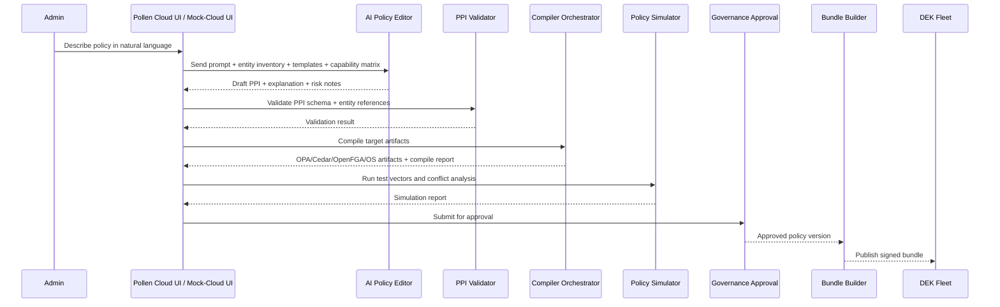
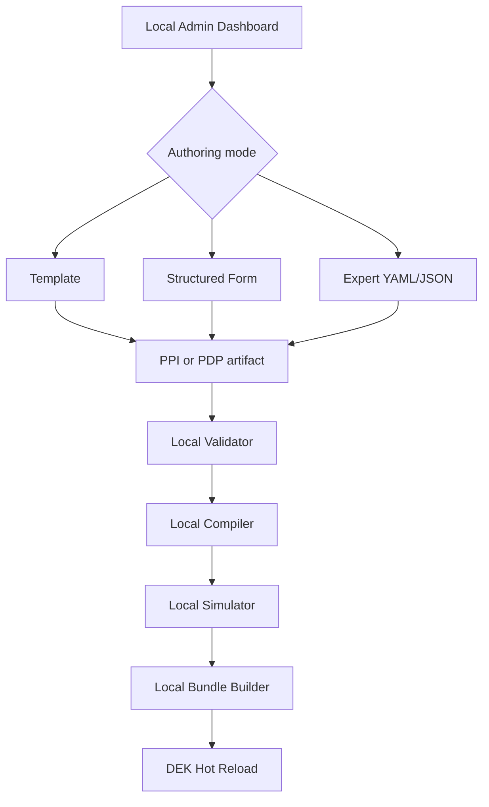
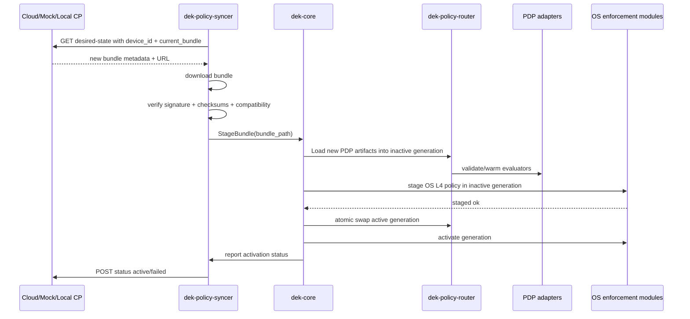
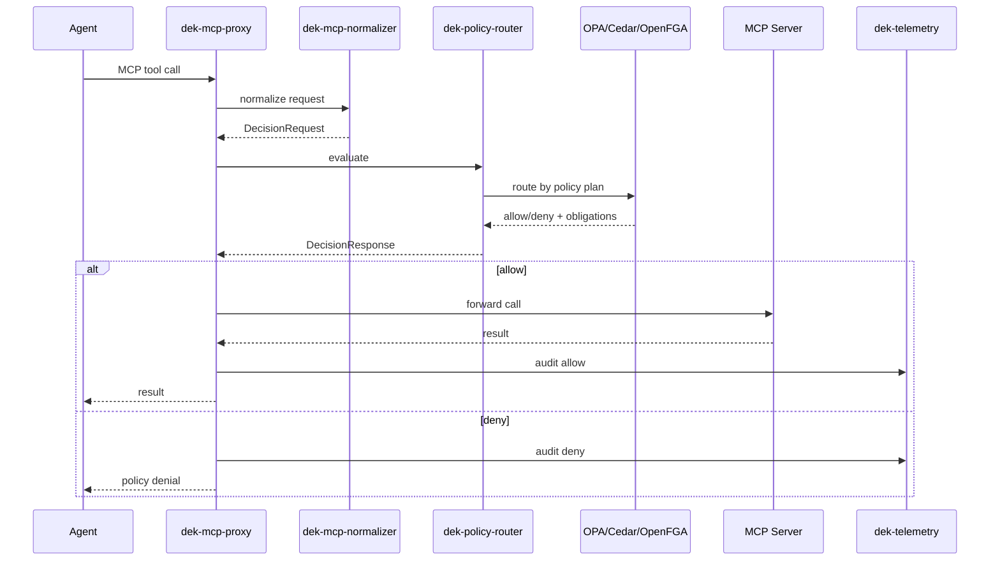
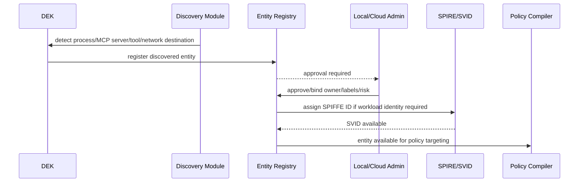
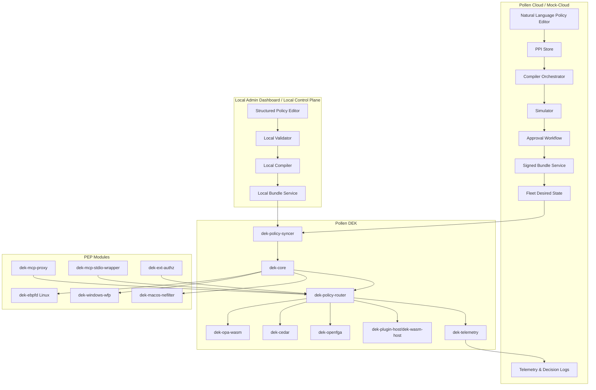

# Pollen DEK Policy Enforcement Flows Design & Implementation Guide

**Document version:** 1.0  
**Target release:** Pollen DEK v1.0.0-beta / Mock-Cloud test release  
**Date:** 2026-06-10  
**Audience:** Pollen DEK core developers, Local Dashboard developers, Mock-Cloud/Pollen Cloud developers, policy-engine developers, OS enforcement developers

---

## 1. Executive Summary

เอกสารนี้ออกแบบ **Policy Enforcement Flows** ของระบบ Pollen DEK ตั้งแต่การสร้าง Policy บน Pollen Cloud / Mock-Cloud / Local Dashboard ไปจนถึงการ compile, validate, deploy, hot reload, enforce และ audit บน DEK runtime จริง โดยออกแบบให้เข้ากับ repository ปัจจุบันของ `AECInfraconnect/AntiG_Pollen_DEK` ให้มากที่สุด

จาก repo ล่าสุด Pollen DEK มีโครงสร้างที่เหมาะกับแนวทางนี้อยู่แล้ว ได้แก่:

- `dek-core` เป็น supervisor / sidecar process
- `dek-policy-router` สำหรับ route request ไปยัง evaluator หลายแบบ
- `dek-policy-syncer` / `dek-bundle-sync` สำหรับ bundle sync และ hot reload
- `dek-opa-wasm`, `dek-cedar`, `dek-openfga` เป็น PDP adapters
- `dek-ebpfd`, `dek-windows-wfp`, `dek-macos-nefilter` เป็น OS/kernel-layer enforcement modules
- `dek-mcp-proxy`, `dek-mcp-stdio-wrapper`, `dek-ext-authz`, `dek-agent-connector` เป็น PEP/front-door modules
- `dek-plugin-host`, `dek-wasm-host`, `dek-plugin-sdk` สำหรับ transform/enrichment plugin
- `local-control-plane`, `apps/local-admin-dashboard`, `ui/mock-cloud` สำหรับ local/mock control plane
- `dek-domain-schema`, `dek-enforcement-api`, `dek-control-plane-api`, `dek-decision` เป็นจุดที่ควรใช้กำหนด contract กลาง

**ข้อเสนอหลัก:**

1. ให้สร้าง policy ในรูปแบบกลางชื่อ **Pollen Policy Intent (PPI)** ก่อนเสมอ
2. ให้ระบบ compile policy จาก PPI ไปยัง PDP target แบบอัตโนมัติ: OPA, Cedar, OpenFGA, OS Kernel Policy, WASM plugin config
3. ให้ policy bundle เป็น immutable, signed, versioned และ atomic-hot-reload ได้
4. ให้ DEK เลือก PDP/PEP/OS layer ตาม `policy_type`, `enforcement_point`, `target_scope`, `latency_budget`, `required_context`
5. ให้ Local Dashboard ไม่มี AI แต่มี structured editor + template + validator; Pollen Cloud/Mock-Cloud มี Natural Language Policy Editor + AI Compiler Orchestrator
6. ให้ Entity lifecycle เป็น first-class model: Tenant, Device, Workload, Process, Agent, MCP Server, Tool, Resource, Network Destination, User, Group, Policy, Bundle, Plugin, PDP, PEP
7. ให้ kernel-layer enforcement ใช้เฉพาะ policy ที่ตัดสินจาก metadata ได้ เช่น IP, port, protocol, process identity, binary hash, DNS-derived destination; ส่วน semantic/data policy ต้องใช้ L7/MCP/API PEP

---

## 2. Research Basis & Best-Practice References

### 2.1 OPA

OPA ออกแบบสำหรับ distributed policy enforcement โดยให้ policy/data อยู่ใกล้ service เพื่อ latency ต่ำและ availability สูง และมี management APIs สำหรับ bundle distribution, decision logs, status และ discovery. แนวคิดนี้เหมาะกับ Pollen DEK ที่ต้องทำ local-first enforcement และ sync จาก control plane.

Key practices:

- ใช้ bundle เป็น distribution unit
- ใช้ decision logs เพื่อ audit/debug
- ใช้ status เพื่อรายงาน agent state
- ใช้ discovery/dynamic config หากต้องบริหาร agent จำนวนมาก
- local evaluator ต้องทำงานต่อได้เมื่อ cloud offline

References:

- OPA Management APIs and Architecture: https://www.openpolicyagent.org/docs/management-introduction
- OPA Bundles: https://www.openpolicyagent.org/docs/management-bundles
- OPA Decision Logs: https://www.openpolicyagent.org/docs/management-decision-logs
- OPA REST API: https://www.openpolicyagent.org/docs/rest-api

### 2.2 Cedar

Cedar เหมาะกับ fine-grained application authorization แบบ principal/action/resource/context และควร validate policy กับ schema ตอน create/update ก่อนเอาไป runtime. Cedar default decision เป็น deny ถ้าไม่มี policy grant access ดังนั้นการออกแบบ fallback และ explicit policy scope ต้องชัดเจน.

Key practices:

- ต้องมี Cedar schema ต่อ application/domain
- validate policy ก่อน deploy
- entity model ต้องชัด: uid, parents, attrs, tags
- เหมาะกับ ABAC/RBAC application permission, tool permission, resource permission

References:

- Cedar policy validation: https://docs.cedarpolicy.com/policies/validation.html
- Cedar schema: https://docs.cedarpolicy.com/schema/schema.html
- Cedar entities syntax: https://docs.cedarpolicy.com/auth/entities-syntax.html

### 2.3 OpenFGA

OpenFGA เหมาะกับ relationship-based authorization. Check ตัดสินจาก authorization model + relationship tuples. Store ใช้แยก authorization environment/model และ tuple ควรอยู่ใน store เดียวกันถ้าส่งผลต่อ decision เดียวกัน.

Key practices:

- ใช้ OpenFGA เมื่อ policy คือ relationship เช่น owner/viewer/member/delegate/allowed_tool
- authorization model immutable/versioned
- tuples เป็น entity lifecycle state ไม่ใช่ policy text
- เหมาะกับ graph permission, team/project/resource relationship, agent delegation

References:

- OpenFGA Concepts: https://openfga.dev/docs/concepts
- OpenFGA Modeling: https://openfga.dev/docs/modeling/getting-started

### 2.4 SPIFFE/SPIRE Workload Identity

SPIFFE ID เป็น URI ที่ identify workload อย่าง unique; workload อาจละเอียดถึงระดับ process และ SVID เป็น credential ที่พิสูจน์ identity ได้. Pollen DEK ควร bind policy scope กับ workload identity ไม่ใช่แค่ process name หรือ path.

Key practices:

- ใช้ SPIFFE ID สำหรับ DEK, workload, agent, MCP server, local PDP, plugin host
- X.509-SVID เหมาะกับ mTLS ระหว่าง DEK ↔ control plane / local components
- JWT-SVID เหมาะกับ request-bound assertion หรือ exchange กับ external service
- trust domain ควรแยก environment เช่น dev/staging/prod/tenant

Reference:

- SPIFFE Concepts: https://spiffe.io/docs/latest/spiffe-about/spiffe-concepts/

### 2.5 OS Kernel / L4 Enforcement

Linux, Windows, macOS มี enforcement primitive ต่างกัน จึงต้องใช้ policy profile กลาง แล้ว compile เป็น OS-specific plan:

- Linux: eBPF/cgroup hooks เหมาะกับ connect/bind/DNS/network metadata enforcement
- Windows: WFP ALE layers เหมาะกับ stateful filtering per connection/socket operation
- macOS: NetworkExtension Content Filter ใช้ allow/block flow; filter provider ไม่ควรพยายามเป็น packet rewrite engine

References:

- Linux libbpf program types: https://docs.kernel.org/bpf/libbpf/program_types.html
- Microsoft WFP ALE: https://learn.microsoft.com/en-us/windows/win32/fwp/application-layer-enforcement--ale-
- Microsoft ALE layers: https://learn.microsoft.com/en-us/windows/win32/fwp/ale-layers
- Apple NetworkExtension content filter providers: https://developer.apple.com/documentation/networkextension/content-filter-providers

---

## 3. Design Principles

### 3.1 Local-first, cloud-managed

DEK ต้อง enforce ได้แม้ Cloud offline โดยใช้ active bundle ล่าสุดที่ verified แล้ว

```text
Cloud/Mock-Cloud unavailable  ->  DEK keeps last good bundle
Invalid new bundle            ->  DEK rejects and stays on last good bundle
Policy engine crash           ->  fail-closed for protected mode, fail-open-audit for observe mode
Kernel module unavailable     ->  degrade to L7/MCP enforcement if possible and raise critical health event
```

### 3.2 Policy Intent first, PDP code second

ห้ามให้ UI ผูกกับ Rego/Cedar/FGA โดยตรงตั้งแต่ต้น ให้ใช้ PPI เป็น intermediate representation:

```text
Natural Language / Structured Form
        ↓
Pollen Policy Intent (PPI)
        ↓ validate intent + entity scope
Compiler Orchestrator
        ↓
OPA / Cedar / OpenFGA / OS Kernel Policy / WASM Plugin Config
        ↓ package as signed bundle
DEK hot reload
```

### 3.3 Explicit scope and target

ทุก policy ต้องระบุ:

- `subjects`: user, group, agent, workload, process, service account
- `resources`: API, MCP tool, file, network destination, DDS topic, model endpoint
- `actions`: connect, call_tool, read, write, publish, subscribe, redact, route, execute
- `enforcement_points`: mcp_proxy, api_gateway, ext_authz, stdio_wrapper, ebpf, wfp, nefilter, plugin_host
- `decision_mode`: enforce, observe, shadow, dry_run
- `fallback`: deny, allow_audit, last_good, quarantine

### 3.4 Compile target by semantics, not by user preference only

ผู้ใช้เลือก intent; compiler เลือก PDP/PEP ที่เหมาะสมโดยอัตโนมัติ แต่ให้ advanced user override ได้ถ้าผ่าน validation

### 3.5 Kernel layer is metadata-only

Kernel L4 policy ห้ามขึ้นกับ semantic payload เช่น prompt, document content, PII text เพราะ eBPF/WFP/NEFilter เหมาะกับ network/process/flow metadata. Semantic policy ต้องใช้ MCP/API/Plugin layer.

---

## 4. Current Repository Fit & Proposed Module Responsibilities

### 4.1 Existing modules to keep

| Existing crate/app | Role in new flow |
|---|---|
| `dek-core` | Supervisor, local API, bundle activation, runtime registry, health |
| `dek-policy-router` | Multi-PDP routing and decision composition |
| `dek-policy-syncer` / `dek-bundle-sync` | Pull/push bundle sync, signature check, atomic hot reload |
| `dek-opa-wasm` | OPA/Rego evaluator via Wasm |
| `dek-cedar` | Cedar evaluator and schema validation |
| `dek-openfga` | OpenFGA local/remote check adapter |
| `dek-enforcement-api` | PEP/provider contract |
| `dek-control-plane-api` | Cloud/Mock-Cloud/Local control-plane API contract |
| `dek-domain-schema` | Entity and policy schema definitions |
| `dek-ebpfd` | Linux L4/DNS enforcement |
| `dek-windows-wfp` | Windows L4 enforcement |
| `dek-macos-nefilter` | macOS flow enforcement |
| `dek-mcp-proxy` | MCP L7 enforcement |
| `dek-mcp-stdio-wrapper` | stdio MCP/tool enforcement |
| `dek-ext-authz` | Envoy/Istio external authorization bridge |
| `dek-wasm-host` / `dek-plugin-host` | Transform/plugin enforcement obligations |
| `local-control-plane` | Local policy CRUD and bundle service |
| `apps/local-admin-dashboard` | Local UI without AI |
| `ui/mock-cloud` / `crates/mock-cloud` | Cloud simulation, AI compiler stub, enterprise flows |

### 4.2 New modules recommended

Add these crates/files:

```text
crates/dek-policy-intent/          # Pollen Policy Intent schema + validators
crates/dek-policy-compiler/        # PPI -> OPA/Cedar/OpenFGA/OS plans
crates/dek-entity-registry/        # Local entity inventory + lifecycle state
crates/dek-capability-registry/    # PDP/PEP/plugin/OS module capability registry
crates/dek-bundle-format/          # Signed bundle manifest, activation plan
crates/dek-policy-simulator/       # compile/test/simulate before deploy
crates/dek-policy-governance/      # approval, maker-checker, change risk scoring
schemas/pollen-policy-intent.schema.json
schemas/pollen-bundle-manifest.schema.json
schemas/pollen-entity.schema.json
schemas/pollen-capability.schema.json
```

---

## 5. Core Domain Model

### 5.1 Entity types

```yaml
entities:
  tenant:
    id: tenant:acme
    trust_domain: spiffe://acme.pollen.local

  device:
    id: device:win-laptop-001
    os: windows
    dek_version: 1.0.0-beta.1
    posture: healthy
    spiffe_id: spiffe://acme.pollen.local/device/win-laptop-001/dek-core

  workload:
    id: workload:claude-desktop
    type: desktop_app
    process_names: [Claude.exe, Claude]
    binary_hashes: []
    owner_user: user:alice
    spiffe_id: spiffe://acme.pollen.local/workload/claude-desktop

  agent:
    id: agent:research-agent-001
    runtime: mcp_client
    parent_workload: workload:claude-desktop

  mcp_server:
    id: mcp:filesystem
    transport: stdio
    owner_workload: workload:claude-desktop

  tool:
    id: tool:filesystem.read_file
    mcp_server: mcp:filesystem
    risk: high

  network_destination:
    id: netdest:openai-api
    hostnames: [api.openai.com]
    ports: [443]
    protocols: [tcp]

  resource:
    id: resource:customer-pii-db
    type: database
    tags: [pii, restricted]
```

### 5.2 Policy object lifecycle

```text
DRAFT
  -> GENERATED        # AI-generated or template-generated
  -> VALIDATED        # syntax + schema + entity + capability checks passed
  -> SIMULATED        # test cases passed
  -> APPROVED         # maker-checker or local admin approval
  -> COMPILED         # target artifacts generated
  -> PACKAGED         # signed immutable bundle produced
  -> DEPLOYED         # assigned to device/groups
  -> ACTIVE           # DEK has activated it
  -> SUPERSEDED       # replaced by newer version
  -> ROLLED_BACK      # rollback occurred
  -> RETIRED          # no longer deployable
```

### 5.3 Bundle lifecycle

```text
CREATED -> SIGNED -> PUBLISHED -> DOWNLOADED -> VERIFIED -> STAGED -> ACTIVATED -> REPORTED
                                                         \-> REJECTED -> ROLLBACK_TO_LAST_GOOD
```

---

## 6. Pollen Policy Intent (PPI)

PPI คือ policy intermediate representation ที่ UI, AI editor, compiler, simulator และ DEK ใช้ร่วมกัน

### 6.1 PPI YAML example

```yaml
apiVersion: pollen.ai/v1alpha1
kind: PolicyIntent
metadata:
  id: pol-allow-openai-for-approved-agents
  tenant: tenant:acme
  name: Allow approved agents to call OpenAI API
  version: 1.0.0
  labels:
    domain: ai-agent
    risk: medium
spec:
  decisionMode: enforce
  priority: 500
  subjects:
    include:
      - type: agent
        selector:
          labels:
            approved: "true"
      - type: workload
        ids:
          - workload:claude-desktop
  actions:
    - network.connect
    - http.request
  resources:
    include:
      - type: network_destination
        ids:
          - netdest:openai-api
      - type: api
        selector:
          host: api.openai.com
          pathPrefix: /v1/
  constraints:
    timeWindow:
      timezone: Asia/Bangkok
      days: [MON,TUE,WED,THU,FRI]
      start: "08:00"
      end: "19:00"
    maxRequestsPerMinute: 120
    requireDevicePosture: healthy
  enforcement:
    preferredPepTypes:
      - ebpf
      - wfp
      - nefilter
      - mcp_proxy
      - ext_authz
    osScope: [linux, windows, macos]
    fallback: deny
  obligations:
    audit:
      level: decision
      includeInput: redacted
    telemetry:
      piiRedaction: true
      spoolEncryption: true
```

### 6.2 PPI JSON Schema sketch

```json
{
  "$schema": "https://json-schema.org/draft/2020-12/schema",
  "$id": "https://schemas.pollen.ai/policy-intent/v1alpha1.schema.json",
  "title": "Pollen Policy Intent",
  "type": "object",
  "required": ["apiVersion", "kind", "metadata", "spec"],
  "properties": {
    "apiVersion": { "const": "pollen.ai/v1alpha1" },
    "kind": { "const": "PolicyIntent" },
    "metadata": {
      "type": "object",
      "required": ["id", "tenant", "name", "version"],
      "properties": {
        "id": { "type": "string", "pattern": "^pol-[a-z0-9-]+$" },
        "tenant": { "type": "string" },
        "name": { "type": "string" },
        "version": { "type": "string" }
      }
    },
    "spec": {
      "type": "object",
      "required": ["decisionMode", "subjects", "actions", "resources", "enforcement"],
      "properties": {
        "decisionMode": { "enum": ["enforce", "observe", "shadow", "dry_run"] },
        "actions": {
          "type": "array",
          "items": { "enum": ["network.connect", "http.request", "mcp.call_tool", "tool.execute", "file.read", "file.write", "dds.publish", "dds.subscribe"] }
        }
      }
    }
  }
}
```

---

## 7. Policy Creation Flow

### 7.1 Pollen Cloud / Mock-Cloud with Natural Language AI Editor



### 7.2 Local Admin Dashboard without AI

Local Dashboard ไม่มี AI จึงควรมี 3 authoring modes:

1. **Template mode** — user เลือก policy template
2. **Structured form mode** — dropdown entity/action/resource/PEP
3. **Expert mode** — paste PPI YAML/JSON หรือ PDP-specific code แต่ต้อง validate ก่อน deploy



### 7.3 Mock-Cloud role

Mock-Cloud ต้อง simulate Cloud แต่ไม่ต้องมี production-grade AI จริงใน beta. ให้ทำ AI stub 3 แบบ:

```text
Mode A: deterministic template compiler
Mode B: LLM-compatible API stub that returns PPI fixture
Mode C: manual PPI editor with compile/simulate/deploy flow
```

Mock-Cloud ควรมี endpoints เหมือน production Cloud เพื่อไม่ต้องเปลี่ยน DEK client:

```http
POST /v1/policy-intents/draft
POST /v1/policy-intents/{id}/validate
POST /v1/policy-intents/{id}/compile
POST /v1/policy-intents/{id}/simulate
POST /v1/policy-intents/{id}/approve
POST /v1/bundles
GET  /v1/bundles/{bundle_id}
GET  /v1/devices/{device_id}/desired-state
POST /v1/devices/{device_id}/status
POST /v1/decision-logs
POST /v1/telemetry/events
```

---

## 8. Automatic Compile Policy Routing

### 8.1 Compiler decision matrix

| Policy semantics | Best target | Why | Example |
|---|---|---|---|
| Relationship permission | OpenFGA | ReBAC graph check | user/team owns project/resource |
| App principal/action/resource/context | Cedar | Fast typed authz with schema validation | agent can call tool if device healthy |
| General rules, risk scoring, constraints | OPA/Rego | Flexible ABAC, data-heavy rules | deny if risk_score > threshold |
| Network L4 allow/block | OS kernel policy | Low-latency flow control | block outbound to unknown IP/port |
| Text/data transformation | WASM plugin | Safe sandboxed transform | redact PII before telemetry/tool call |
| API gateway ext authz | OPA/Cedar via ext_authz | L7 request context | HTTP path/method/header policy |
| MCP tool call | Cedar/OPA + plugin | tool/resource/action + prompt context | allow `read_file` only in workspace |

### 8.2 Routing algorithm

```rust
#[derive(Debug, Clone, PartialEq, Eq)]
pub enum CompileTarget {
    OpaRego,
    OpaWasm,
    Cedar,
    OpenFga,
    OsKernelL4,
    WasmPluginConfig,
}

#[derive(Debug, Clone)]
pub struct IntentFeatures {
    pub has_relationships: bool,
    pub has_principal_action_resource: bool,
    pub has_complex_abac: bool,
    pub has_network_l4: bool,
    pub has_semantic_payload: bool,
    pub requires_data_transform: bool,
    pub requires_rate_limit: bool,
    pub latency_budget_ms: u32,
    pub pep_types: Vec<String>,
}

pub fn choose_compile_targets(f: &IntentFeatures) -> Vec<CompileTarget> {
    let mut targets = Vec::new();

    if f.has_relationships {
        targets.push(CompileTarget::OpenFga);
    }

    if f.has_principal_action_resource && !f.has_complex_abac {
        targets.push(CompileTarget::Cedar);
    }

    if f.has_complex_abac || f.requires_rate_limit || f.has_semantic_payload {
        targets.push(CompileTarget::OpaWasm);
    }

    if f.has_network_l4 && !f.has_semantic_payload {
        targets.push(CompileTarget::OsKernelL4);
    }

    if f.requires_data_transform {
        targets.push(CompileTarget::WasmPluginConfig);
    }

    if targets.is_empty() {
        targets.push(CompileTarget::OpaWasm);
    }

    targets
}
```

### 8.3 Compile conflict rules

```yaml
compile_conflict_rules:
  - id: semantic-payload-not-kernel
    condition: has_semantic_payload && target == os_kernel_l4
    action: reject
    message: Kernel L4 policy cannot depend on prompt/body/content.

  - id: unknown-entity
    condition: referenced_entity_not_found
    action: reject
    message: Policy references unknown entity. Register entity first.

  - id: no-capable-pep
    condition: no_pep_supports_required_action
    action: reject
    message: No active PEP supports this action.

  - id: enforce-requires-fallback
    condition: decisionMode == enforce && fallback == null
    action: reject
    message: Enforce policy must define fallback behavior.

  - id: kernel-policy-requires-os-provider
    condition: target == os_kernel_l4 && device.os_provider.unavailable
    action: compile_without_kernel_and_mark_degraded
```

---

## 9. PDP Target Generation

### 9.1 Cedar generation example

PPI:

```yaml
subjects:
  include:
    - type: agent
      selector: { labels: { approved: "true" } }
actions: [mcp.call_tool]
resources:
  include:
    - type: tool
      ids: [tool:filesystem.read_file]
constraints:
  requireDevicePosture: healthy
```

Generated Cedar schema sketch:

```cedar
namespace Pollen {
  entity User;
  entity Device = { posture: String };
  entity Workload = { owner: User };
  entity Agent = { approved: Bool, workload: Workload };
  entity Tool = { risk: String };

  action "mcp.call_tool" appliesTo {
    principal: Agent,
    resource: Tool,
    context: {
      device: Device,
      request_id: String,
      transport: String
    }
  };
}
```

Generated Cedar policy:

```cedar
permit(
  principal is Pollen::Agent,
  action == Pollen::Action::"mcp.call_tool",
  resource == Pollen::Tool::"filesystem.read_file"
)
when {
  principal.approved == true &&
  context.device.posture == "healthy"
};
```

### 9.2 OPA/Rego generation example

```rego
package pollen.policy.pol_allow_openai

import rego.v1

default allow := false

default obligations := {"audit": true, "pii_redaction": true}

allow if {
  input.action in {"network.connect", "http.request"}
  input.subject.type in {"agent", "workload"}
  input.subject.labels.approved == "true"
  input.resource.host == "api.openai.com"
  input.resource.port == 443
  input.device.posture == "healthy"
  within_working_hours(input.request.time, "Asia/Bangkok")
}

within_working_hours(ts, tz) if {
  # Compiler should replace with safe time-window helper or precomputed context.
  input.context.time_window_allowed == true
}
```

### 9.3 OpenFGA model generation example

```fga
model
  schema 1.1

type user

type group
  relations
    define member: [user]

type agent
  relations
    define owner: [user]
    define operator: [user, group#member]

type tool
  relations
    define owner: [user]
    define caller: [agent, user, group#member]
    define can_call: caller or owner
```

Generated tuples:

```json
[
  { "user": "agent:research-agent-001", "relation": "caller", "object": "tool:filesystem.read_file" },
  { "user": "group:ai-admins#member", "relation": "caller", "object": "tool:browser.search" }
]
```

### 9.4 OS L4 policy generation example

```json
{
  "apiVersion": "pollen.ai/v1alpha1",
  "kind": "OsL4Policy",
  "metadata": {
    "policy_id": "pol-allow-openai-for-approved-agents",
    "bundle_id": "bundle-20260610-001"
  },
  "spec": {
    "mode": "enforce",
    "rules": [
      {
        "id": "allow-openai-443",
        "direction": "outbound",
        "protocol": "tcp",
        "remote_hosts": ["api.openai.com"],
        "remote_ports": [443],
        "subject_selectors": {
          "workload_ids": ["workload:claude-desktop"],
          "process_names": ["Claude.exe", "Claude"]
        },
        "action": "allow",
        "default_action": "deny"
      }
    ],
    "dns_cache": {
      "enabled": true,
      "ttl_seconds": 300,
      "max_entries": 65536,
      "eviction": "lru"
    }
  }
}
```

---

## 10. Bundle Format and Hot Reload

### 10.1 Bundle layout

```text
bundle.tar.gz
  manifest.json
  intent/pol-xxx.yaml
  compiled/opa/pol-xxx.rego
  compiled/opa/pol-xxx.wasm
  compiled/cedar/schema.cedarschema
  compiled/cedar/policies.cedar
  compiled/openfga/model.fga
  compiled/openfga/tuples.json
  compiled/os/os-l4-policy.json
  plugins/pii-redactor/plugin.wasm
  tests/test-vectors.json
  signatures/cosign.bundle
  sbom/spdx.json
```

### 10.2 Manifest

```json
{
  "apiVersion": "pollen.ai/v1alpha1",
  "kind": "PollenPolicyBundle",
  "metadata": {
    "bundle_id": "bundle-20260610-001",
    "tenant": "tenant:acme",
    "version": "2026.06.10-001",
    "created_at": "2026-06-10T09:00:00Z",
    "created_by": "user:admin"
  },
  "compatibility": {
    "min_dek_version": "1.0.0-beta.1",
    "required_crates": ["dek-policy-router", "dek-opa-wasm", "dek-cedar", "dek-openfga"],
    "required_pep_types": ["mcp_proxy", "os_l4"],
    "required_os_modules": {
      "linux": ["dek-ebpfd"],
      "windows": ["dek-windows-wfp"],
      "macos": ["dek-macos-nefilter"]
    }
  },
  "artifacts": [
    { "type": "ppi", "path": "intent/pol-xxx.yaml", "sha256": "..." },
    { "type": "opa_wasm", "path": "compiled/opa/pol-xxx.wasm", "sha256": "..." },
    { "type": "cedar", "path": "compiled/cedar/policies.cedar", "sha256": "..." },
    { "type": "openfga_model", "path": "compiled/openfga/model.fga", "sha256": "..." },
    { "type": "os_l4", "path": "compiled/os/os-l4-policy.json", "sha256": "..." }
  ],
  "activation": {
    "strategy": "atomic",
    "rollback_on_failure": true,
    "health_check_timeout_ms": 3000,
    "shadow_before_enforce_seconds": 0
  }
}
```

### 10.3 Hot reload protocol



### 10.4 Rust activation model

```rust
use arc_swap::ArcSwap;
use std::sync::Arc;

pub struct ActivePolicyGeneration {
    pub bundle_id: String,
    pub router: PolicyRouter,
    pub os_l4_plan: Option<OsL4Plan>,
    pub created_at_epoch_ms: u64,
}

pub struct PolicyRuntime {
    active: ArcSwap<ActivePolicyGeneration>,
}

impl PolicyRuntime {
    pub fn active_bundle_id(&self) -> String {
        self.active.load().bundle_id.clone()
    }

    pub async fn stage_and_activate(&self, bundle: VerifiedBundle) -> anyhow::Result<()> {
        let staged_router = PolicyRouter::from_bundle(&bundle).await?;
        staged_router.health_check().await?;

        let staged_os_plan = OsL4Plan::from_bundle(&bundle).ok();
        if let Some(plan) = &staged_os_plan {
            plan.stage().await?;
        }

        let new_generation = Arc::new(ActivePolicyGeneration {
            bundle_id: bundle.manifest.metadata.bundle_id.clone(),
            router: staged_router,
            os_l4_plan: staged_os_plan,
            created_at_epoch_ms: now_ms(),
        });

        self.active.store(new_generation.clone());

        if let Some(plan) = &new_generation.os_l4_plan {
            plan.activate().await?;
        }

        Ok(())
    }
}

fn now_ms() -> u64 { 0 }
```

---

## 11. Capability Registry

DEK ต้องตรวจสอบก่อน deploy ว่าเครื่องนั้นมี PDP/PEP/OS module อะไรบ้าง

### 11.1 Capability document from DEK

```json
{
  "device_id": "device-001",
  "dek_version": "1.0.0-beta.1",
  "os": { "type": "windows", "version": "11", "arch": "x86_64" },
  "pdp": [
    { "type": "opa_wasm", "version": "1", "status": "ready" },
    { "type": "cedar", "version": "1", "status": "ready" },
    { "type": "openfga", "mode": "local_embedded", "status": "ready" }
  ],
  "pep": [
    { "type": "mcp_proxy", "transports": ["http", "stdio"], "status": "ready" },
    { "type": "ext_authz", "status": "disabled" },
    { "type": "os_l4", "provider": "wfp", "status": "ready" }
  ],
  "plugins": [
    { "id": "pii-redactor", "abi": "pollen-plugin-v1", "status": "ready" }
  ],
  "kernel": {
    "linux_ebpf": null,
    "windows_wfp": { "available": true, "mode": "user_mode_static_filters" },
    "macos_nefilter": null
  }
}
```

### 11.2 Capability matching code

```rust
pub fn can_deploy(policy: &PolicyIntent, caps: &DeviceCapabilities) -> Result<(), DeployBlocker> {
    for pep in &policy.spec.enforcement.preferred_pep_types {
        if !caps.pep.iter().any(|p| p.r#type == *pep && p.status == "ready") {
            return Err(DeployBlocker::MissingPep(pep.clone()));
        }
    }

    if policy.requires_kernel_l4() && !caps.has_os_l4_ready() {
        return Err(DeployBlocker::MissingKernelProvider);
    }

    if policy.requires_semantic_payload() && policy.only_targets_kernel() {
        return Err(DeployBlocker::InvalidKernelSemanticPolicy);
    }

    Ok(())
}
```

---

## 12. Enforcement Flow by PEP Type

### 12.1 MCP Proxy HTTP flow



### 12.2 stdio wrapper flow

```text
Agent process -> dek-mcp-stdio-wrapper -> normalize JSON-RPC/MCP message -> local decision API -> allow/deny/transform -> child MCP process
```

### 12.3 ext_authz flow

```text
Envoy/Istio -> dek-ext-authz -> DecisionRequest -> dek-policy-router -> allow/deny headers/body
```

### 12.4 OS L4 flow

```text
Process opens connection
  Linux: cgroup/connect4 or connect6 -> dek-ebpfd map lookup -> allow/deny
  Windows: WFP ALE_AUTH_CONNECT/RECV_ACCEPT -> filter/callout -> allow/block
  macOS: NEFilterDataProvider handleNewFlow -> allow/drop
Telemetry event -> dek-core/dek-telemetry -> encrypted spool -> Cloud/Mock-Cloud
```

---

## 13. Enforcement Flow by Policy Type

| Policy type | Example | PDP | PEP | Kernel involvement |
|---|---|---|---|---|
| Network allow/deny | block unknown outbound 443 | OS L4 plan + optional OPA precompute | eBPF/WFP/NEFilter | Required |
| MCP tool authorization | agent can call filesystem.read_file | Cedar/OpenFGA/OPA | MCP proxy/stdio wrapper | Not needed |
| API authorization | POST /v1/chat allowed by role | OPA/Cedar | ext_authz/API gateway | Not needed |
| Data redaction | redact email/phone before telemetry | WASM plugin + OPA obligations | plugin_host/MCP/API | Not needed |
| Relationship access | user member of team can access resource | OpenFGA | MCP/API/ext_authz | Not needed |
| Device posture policy | allow only healthy DEK devices | Cedar/OPA | all PEPs | Optional for L4 |
| Rate/quota | max 120 rpm | OPA + local counters | MCP/API | Not kernel in beta |
| DNS/IP cache policy | allow resolved IP for hostname | OS L4 plan | eBPF/WFP/NEFilter | Required |

---

## 14. Cross-OS Kernel Enforcement Design

### 14.1 Common OS L4 policy contract

```rust
#[derive(Debug, Clone, serde::Serialize, serde::Deserialize)]
pub struct OsL4Policy {
    pub policy_id: String,
    pub mode: EnforcementMode,
    pub rules: Vec<OsL4Rule>,
    pub dns_cache: DnsCachePolicy,
}

#[derive(Debug, Clone, serde::Serialize, serde::Deserialize)]
pub struct OsL4Rule {
    pub id: String,
    pub direction: Direction,
    pub protocol: Protocol,
    pub remote_hosts: Vec<String>,
    pub remote_ips: Vec<String>,
    pub remote_ports: Vec<u16>,
    pub process_selectors: ProcessSelectors,
    pub action: L4Action,
    pub default_action: L4Action,
}
```

### 14.2 Linux eBPF plan

Use `dek-ebpfd`:

- DNS resolver event updates `dns_ip_cache_v4/v6` LRU map
- connect4/connect6 hook checks process/workload selector + destination IP/port
- ringbuf emits allow/deny/audit events
- use LRU map for high-cardinality DNS/IP cache

```c
SEC("cgroup/connect4")
int pollen_connect4(struct bpf_sock_addr *ctx) {
    struct l4_key key = {};
    key.dst_ip = ctx->user_ip4;
    key.dst_port = bpf_ntohs(ctx->user_port);
    key.protocol = IPPROTO_TCP;

    struct l4_decision *decision = bpf_map_lookup_elem(&l4_policy_map, &key);
    if (!decision) {
        return DEFAULT_DENY ? 0 : 1;
    }
    return decision->allow ? 1 : 0;
}
```

### 14.3 Windows WFP plan

Use `dek-windows-wfp`:

- GA path: user-mode WFP filters at ALE layers
- Advanced path: callout driver if dynamic classify-time PDP decision needed
- Target layers:
  - `FWPM_LAYER_ALE_AUTH_CONNECT_V4/V6` outbound
  - `FWPM_LAYER_ALE_AUTH_RECV_ACCEPT_V4/V6` inbound
  - discard layers for logging

```cpp
// Simplified WFP static filter sketch
FWPM_FILTER0 filter = {0};
filter.displayData.name = const_cast<wchar_t*>(L"Pollen DEK outbound allow api.openai.com:443");
filter.layerKey = FWPM_LAYER_ALE_AUTH_CONNECT_V4;
filter.action.type = FWP_ACTION_PERMIT;
filter.weight.type = FWP_EMPTY;
filter.numFilterConditions = conditionCount;
filter.filterCondition = conditions;

DWORD status = FwpmFilterAdd0(engineHandle, &filter, NULL, &filterId);
if (status != ERROR_SUCCESS) {
    // report activation failure to dek-core
}
```

### 14.4 macOS NEFilter plan

Use `dek-macos-nefilter`:

- NEFilterDataProvider decides new TCP/UDP flows
- control provider receives policy updates from DEK daemon
- use metadata-first enforcement; avoid payload exfiltration and TLS MITM in beta

```swift
final class PollenFilterDataProvider: NEFilterDataProvider {
    override func handleNewFlow(_ flow: NEFilterFlow) -> NEFilterNewFlowVerdict {
        guard let socketFlow = flow as? NEFilterSocketFlow else {
            return .allow()
        }

        let decision = PollenPolicyCache.shared.decide(flow: socketFlow)
        switch decision {
        case .allow:
            return .allow()
        case .deny:
            return .drop()
        case .needMoreData:
            return .filterDataVerdict(withFilterInbound: false, peekInboundBytes: 0,
                                      filterOutbound: true, peekOutboundBytes: 0)
        }
    }
}
```

---

## 15. Decision Composition Model

เมื่อ policy หลายตัว apply พร้อมกัน ให้ใช้ deterministic composition:

```text
1. explicit deny wins
2. quarantine wins over allow
3. allow requires at least one matching allow policy when resource is protected
4. observe/shadow never override enforce
5. obligations merge by strictest setting
6. break-glass allow must be explicit, time-bound, audited, and cannot bypass kernel deny unless configured
```

### 15.1 DecisionResponse

```rust
#[derive(Debug, Clone, serde::Serialize, serde::Deserialize)]
pub struct DecisionResponse {
    pub decision_id: String,
    pub allowed: bool,
    pub effect: Effect,
    pub reason: String,
    pub matched_policies: Vec<String>,
    pub obligations: Vec<Obligation>,
    pub ttl_ms: Option<u64>,
    pub bundle_id: String,
    pub generation: u64,
}

#[derive(Debug, Clone, serde::Serialize, serde::Deserialize)]
pub enum Effect {
    Allow,
    Deny,
    Quarantine,
    AllowAudit,
    ShadowDeny,
}
```

---

## 16. Entity Lifecycle Management

### 16.1 Lifecycle states

```text
DISCOVERED -> REGISTERED -> ATTESTED -> APPROVED -> ACTIVE -> SUSPENDED -> RETIRED
```

### 16.2 Entity registration flow



### 16.3 Entity security requirements

| Entity | Required identity binding | Required lifecycle control |
|---|---|---|
| DEK device | device certificate + SVID | enrollment, rotation, revoke |
| Workload/process | binary hash + path + signer + optional SVID | discovery, approval, drift detection |
| Agent | parent workload + runtime instance ID | session lifecycle, delegation expiry |
| MCP server | transport + executable + tool list | tool inventory, risk classification |
| Tool | server + action schema + risk labels | allowlist, schema validation |
| Network destination | DNS + IP cache + cert metadata optional | TTL, LRU, deny unknown |
| User/group | OIDC/SCIM/local admin | role mapping, MFA for approval |
| Policy | immutable version + signature | approval, rollback, retirement |
| Plugin | signed WASM + ABI + SBOM | sandbox, version pinning |

---

## 17. Control Plane APIs

### 17.1 Desired state API

```http
GET /v1/devices/{device_id}/desired-state?current_bundle=bundle-123
Authorization: Bearer <SVID/JWT or mTLS-bound token>
```

Response:

```json
{
  "device_id": "device-001",
  "desired_bundle": {
    "bundle_id": "bundle-20260610-001",
    "version": "2026.06.10-001",
    "url": "https://mock-cloud.local/bundles/bundle-20260610-001.tar.gz",
    "sha256": "...",
    "signature": "..."
  },
  "activation": {
    "mode": "hot_reload",
    "deadline": "2026-06-10T10:00:00Z"
  }
}
```

### 17.2 Status API

```http
POST /v1/devices/{device_id}/status
Content-Type: application/json
```

```json
{
  "device_id": "device-001",
  "bundle_id": "bundle-20260610-001",
  "status": "active",
  "capabilities": {},
  "health": {
    "dek_core": "ready",
    "policy_router": "ready",
    "os_l4": "ready",
    "telemetry_spool": "ready"
  },
  "last_error": null
}
```

### 17.3 Decision log API

Compatible conceptually with OPA decision logs but extended with Pollen fields:

```json
{
  "decision_id": "01HX...",
  "tenant": "tenant:acme",
  "device_id": "device-001",
  "bundle_id": "bundle-20260610-001",
  "pep_type": "mcp_proxy",
  "pdp_targets": ["cedar", "openfga"],
  "subject": { "type": "agent", "id": "agent:research-agent-001" },
  "action": "mcp.call_tool",
  "resource": { "type": "tool", "id": "tool:filesystem.read_file" },
  "effect": "deny",
  "matched_policies": ["pol-deny-sensitive-files"],
  "input_hash": "sha256:...",
  "redaction_applied": true,
  "timestamp": "2026-06-10T09:10:00Z"
}
```

---

## 18. Local Dashboard UX Requirements

### 18.1 Pages

```text
1. Overview
   - DEK status, active bundle, PDP/PEP health, OS provider status
2. Entities
   - discovered workloads, agents, MCP servers, tools, network destinations
3. Policies
   - templates, structured editor, expert editor
4. Compile & Simulation
   - compile targets, validation errors, test vectors
5. Deployments
   - staged/active bundles, rollback button
6. Decision Logs
   - filter by entity/policy/effect/PEP
7. Settings
   - fallback mode, telemetry, spool encryption, Cloud/Local mode
```

### 18.2 Local policy editor constraints

- No AI generation
- Must not allow unvalidated direct deploy
- Must show compile target explanation
- Must show unsupported targets by current device capabilities
- Must support export/import PPI YAML
- Must support “simulate before enforce”

### 18.3 React/TypeScript model

```ts
export type CompileTarget = "opa_wasm" | "cedar" | "openfga" | "os_l4" | "wasm_plugin";

export interface PolicyIntentFormState {
  id: string;
  name: string;
  decisionMode: "enforce" | "observe" | "shadow" | "dry_run";
  subjects: EntitySelector[];
  actions: string[];
  resources: EntitySelector[];
  constraints: Record<string, unknown>;
  preferredPepTypes: string[];
  fallback: "deny" | "allow_audit" | "last_good" | "quarantine";
}

export interface CompileReport {
  valid: boolean;
  targets: CompileTarget[];
  errors: Array<{ code: string; message: string; path?: string }>;
  warnings: Array<{ code: string; message: string }>;
  artifacts: Array<{ type: string; path: string }>;
}
```

---

## 19. Mock-Cloud Implementation Plan

### 19.1 Mock-Cloud services

```text
mock-cloud-api
  - policy intent CRUD
  - deterministic compiler
  - bundle builder
  - device desired-state
  - status/telemetry ingestion

mock-cloud-ui
  - Natural Language editor stub
  - policy approval workflow
  - deployment target selection
  - device/bundle/logs views
```

### 19.2 Mock NL Policy endpoint

```ts
import express from "express";
import { z } from "zod";

const app = express();
app.use(express.json());

const DraftRequest = z.object({
  tenant: z.string(),
  prompt: z.string(),
  targetEntities: z.array(z.string()).default([]),
});

app.post("/v1/policy-intents/draft", (req, res) => {
  const input = DraftRequest.parse(req.body);

  // Deterministic beta stub. Replace with AI orchestrator in Pollen Cloud.
  const ppi = {
    apiVersion: "pollen.ai/v1alpha1",
    kind: "PolicyIntent",
    metadata: {
      id: `pol-${Date.now()}`,
      tenant: input.tenant,
      name: "Generated from NL prompt",
      version: "0.1.0"
    },
    spec: {
      decisionMode: "enforce",
      priority: 500,
      subjects: { include: [{ type: "agent", selector: { labels: { approved: "true" } } }] },
      actions: ["mcp.call_tool"],
      resources: { include: [{ type: "tool", selector: { risk: "low" } }] },
      constraints: { requireDevicePosture: "healthy" },
      enforcement: { preferredPepTypes: ["mcp_proxy"], fallback: "deny" },
      obligations: { audit: { level: "decision", includeInput: "redacted" } }
    }
  };

  res.json({ ppi, explanation: "Drafted from deterministic template. Review before deploy." });
});

app.listen(8788);
```

---

## 20. Compiler Implementation Sketch

```rust
pub struct CompileContext {
    pub entities: EntityRegistrySnapshot,
    pub capabilities: DeviceCapabilities,
    pub templates: TemplateRegistry,
}

pub struct CompileOutput {
    pub report: CompileReport,
    pub artifacts: Vec<CompiledArtifact>,
}

#[async_trait::async_trait]
pub trait PolicyCompiler: Send + Sync {
    fn target(&self) -> CompileTarget;
    async fn validate(&self, intent: &PolicyIntent, ctx: &CompileContext) -> anyhow::Result<()>;
    async fn compile(&self, intent: &PolicyIntent, ctx: &CompileContext) -> anyhow::Result<CompiledArtifact>;
}

pub struct CompilerOrchestrator {
    compilers: Vec<Box<dyn PolicyCompiler>>,
}

impl CompilerOrchestrator {
    pub async fn compile_all(&self, intent: &PolicyIntent, ctx: &CompileContext) -> anyhow::Result<CompileOutput> {
        let features = IntentAnalyzer::analyze(intent);
        let targets = choose_compile_targets(&features);
        let mut artifacts = Vec::new();
        let mut report = CompileReport::new(targets.clone());

        for target in targets {
            let compiler = self.compilers.iter().find(|c| c.target() == target)
                .ok_or_else(|| anyhow::anyhow!("missing compiler for {:?}", target))?;

            match compiler.validate(intent, ctx).await {
                Ok(_) => match compiler.compile(intent, ctx).await {
                    Ok(artifact) => artifacts.push(artifact),
                    Err(e) => report.errors.push(format!("compile {:?}: {e}", target)),
                },
                Err(e) => report.errors.push(format!("validate {:?}: {e}", target)),
            }
        }

        report.valid = report.errors.is_empty();
        Ok(CompileOutput { report, artifacts })
    }
}
```

---

## 21. Policy Router Implementation Sketch

```rust
#[async_trait::async_trait]
pub trait PolicyEvaluator: Send + Sync {
    fn id(&self) -> &str;
    fn target(&self) -> CompileTarget;
    async fn evaluate(&self, req: &DecisionRequest) -> anyhow::Result<PartialDecision>;
}

pub struct PolicyRouter {
    evaluators: Vec<Box<dyn PolicyEvaluator>>,
    plan: RoutingPlan,
}

impl PolicyRouter {
    pub async fn decide(&self, req: DecisionRequest) -> anyhow::Result<DecisionResponse> {
        let selected = self.plan.select_evaluators(&req);
        let mut partials = Vec::new();

        for eval_id in selected {
            let evaluator = self.evaluators.iter().find(|e| e.id() == eval_id)
                .ok_or_else(|| anyhow::anyhow!("missing evaluator {eval_id}"))?;
            partials.push(evaluator.evaluate(&req).await?);
        }

        Ok(compose_decisions(req, partials, &self.plan))
    }
}

fn compose_decisions(req: DecisionRequest, partials: Vec<PartialDecision>, plan: &RoutingPlan) -> DecisionResponse {
    let explicit_deny = partials.iter().any(|p| matches!(p.effect, Effect::Deny | Effect::Quarantine));
    let allowed = !explicit_deny && partials.iter().any(|p| matches!(p.effect, Effect::Allow));

    DecisionResponse {
        decision_id: req.decision_id,
        allowed,
        effect: if explicit_deny { Effect::Deny } else if allowed { Effect::Allow } else { Effect::Deny },
        reason: "composed by deny-wins strategy".to_string(),
        matched_policies: partials.iter().flat_map(|p| p.matched_policies.clone()).collect(),
        obligations: merge_obligations(partials),
        ttl_ms: Some(plan.default_decision_ttl_ms),
        bundle_id: plan.bundle_id.clone(),
        generation: plan.generation,
    }
}
```

---

## 22. Security Controls

### 22.1 Bundle security

- Bundle must be signed
- Verify checksum of every artifact
- Verify minimum DEK version and ABI compatibility
- Reject unsigned plugin WASM in enforce mode
- Keep last known good bundle
- Use atomic generation switch
- Activation failure must rollback

### 22.2 AI policy editor safety

For Pollen Cloud AI Policy Editor:

- AI output is never directly deployed
- AI can produce only PPI draft or compiler hints
- Compiler is deterministic and authoritative
- Show explanation and risk score to admin
- Require simulation and approval
- Store prompt, draft, final PPI, compile report for audit

### 22.3 Local Dashboard safety

- No AI
- No direct raw Rego/Cedar/FGA deploy unless expert mode and validation passes
- Dangerous policy changes require confirmation
- Enforce mode requires fallback setting
- Kernel policy requires OS provider capability and rollback plan

### 22.4 Runtime safety

- PDP timeouts per request
- Circuit breaker per evaluator
- Fail-closed/allow-audit by policy mode
- Plugin sandbox with fuel/epoch limits in Wasmtime
- Telemetry spool encryption at rest
- PII redaction before cloud upload
- Decision logs must include input hash and redacted input, not raw secrets

---

## 23. Testing Strategy

### 23.1 Unit tests

```text
- PPI schema validation
- Intent feature extraction
- Compile target routing
- Cedar schema generation
- Rego generation
- OpenFGA model/tuple generation
- OS L4 policy generation
- Decision composition
- Bundle manifest validation
```

### 23.2 Integration tests

```text
- Mock-Cloud creates policy -> compile -> build bundle -> DEK downloads -> hot reload
- Local Dashboard creates structured policy -> local-control-plane -> DEK active
- MCP tool call allow/deny
- stdio wrapper allow/deny
- ext_authz allow/deny
- Linux eBPF allow/deny to destination
- Windows WFP allow/deny to destination
- macOS NEFilter allow/drop flow
- rollback on invalid bundle
- offline mode uses last good bundle
```

### 23.3 Test vector format

```json
{
  "policy_id": "pol-allow-openai-for-approved-agents",
  "cases": [
    {
      "name": "approved agent can connect to OpenAI",
      "input": {
        "subject": { "type": "agent", "id": "agent:research", "labels": { "approved": "true" } },
        "action": "network.connect",
        "resource": { "host": "api.openai.com", "port": 443 },
        "device": { "posture": "healthy" }
      },
      "expect": { "allowed": true }
    },
    {
      "name": "unapproved agent denied",
      "input": {
        "subject": { "type": "agent", "id": "agent:unknown", "labels": { "approved": "false" } },
        "action": "network.connect",
        "resource": { "host": "api.openai.com", "port": 443 },
        "device": { "posture": "healthy" }
      },
      "expect": { "allowed": false }
    }
  ]
}
```

---

## 24. Observability & Audit

### 24.1 Required metrics

```text
pollen_policy_compile_total{target,status}
pollen_policy_bundle_download_total{status}
pollen_policy_bundle_activation_total{status}
pollen_policy_decision_total{pep,pdp,effect}
pollen_policy_decision_latency_ms{pep,pdp}
pollen_policy_router_evaluator_timeout_total{pdp}
pollen_os_l4_flow_total{os,provider,effect}
pollen_os_l4_map_pressure_ratio{map}
pollen_telemetry_spool_bytes{encrypted}
pollen_policy_rollback_total{reason}
```

### 24.2 Required audit events

```text
policy.created
policy.generated_by_ai
policy.validated
policy.compiled
policy.simulated
policy.approved
bundle.signed
bundle.published
bundle.downloaded
bundle.verified
bundle.activated
bundle.rejected
bundle.rolled_back
entity.discovered
entity.approved
entity.suspended
decision.allow
decision.deny
kernel.flow.allow
kernel.flow.deny
plugin.loaded
plugin.rejected
```

---

## 25. Phased Implementation Plan

### Phase 0 — Stabilize contracts

- Add `dek-policy-intent`
- Add schema files
- Add `dek-bundle-format`
- Add `dek-capability-registry`
- Define `DecisionRequest` / `DecisionResponse` v1 in `dek-decision`

### Phase 1 — Mock-Cloud + Local Dashboard flow

- Mock-Cloud policy CRUD
- Deterministic NL draft stub
- Local Dashboard structured editor
- PPI validator
- Compile report UI
- Bundle builder
- Desired-state endpoint

### Phase 2 — Compiler Orchestrator

- PPI analyzer
- OPA compiler
- Cedar compiler
- OpenFGA compiler
- OS L4 compiler
- test vector simulator

### Phase 3 — DEK hot reload

- Bundle download/verify/stage/activate
- ArcSwap active generation
- Rollback
- Status reporting
- decision logs

### Phase 4 — PEP integration

- MCP proxy decision path
- stdio wrapper decision path
- ext_authz bridge
- plugin obligations

### Phase 5 — OS enforcement

- Linux `dek-ebpfd` OS L4 policy loader
- Windows `dek-windows-wfp` WFP static filters
- macOS `dek-macos-nefilter` flow policy cache
- Cross-OS metrics

### Phase 6 — Production hardening

- Signed bundles
- Signed plugins
- SBOM
- policy conflict analysis
- shadow mode
- migration/rollback
- stress/load tests
- security review

---

## 26. Acceptance Criteria for v1.0.0-beta

### 26.1 Must have

- Create policy from Local Dashboard structured form
- Create policy from Mock-Cloud deterministic NL stub
- Compile at least 3 targets: OPA, Cedar, OS L4
- Bundle signed/checksummed at least using local dev key
- DEK downloads, verifies, hot reloads bundle
- MCP proxy enforces allow/deny
- One OS provider works per OS target:
  - Linux eBPF if running Linux
  - Windows WFP if running Windows
  - macOS NEFilter if running macOS
- Decision logs sent to Mock-Cloud or encrypted spool
- Rollback to last good bundle works

### 26.2 Should have

- OpenFGA model/tuple compilation
- policy simulator with test vectors
- capability matrix UI
- entity discovery/approval UI
- shadow mode
- bundle activation health checks

### 26.3 Must not

- Deploy AI-generated policy without deterministic validation
- Enforce semantic payload policy at kernel layer
- Replace active bundle without last-good rollback
- Upload raw PII in decision logs by default
- Assume Cloud is always online

---

## 27. Recommended File/Code Changes

```text
crates/dek-policy-intent/
  Cargo.toml
  src/lib.rs
  src/schema.rs
  src/validate.rs
  src/analyze.rs

crates/dek-policy-compiler/
  Cargo.toml
  src/lib.rs
  src/orchestrator.rs
  src/opa.rs
  src/cedar.rs
  src/openfga.rs
  src/os_l4.rs

crates/dek-bundle-format/
  Cargo.toml
  src/manifest.rs
  src/verify.rs
  src/build.rs

crates/dek-capability-registry/
  Cargo.toml
  src/lib.rs

crates/dek-entity-registry/
  Cargo.toml
  src/lib.rs
  src/discovery.rs
  src/lifecycle.rs

schemas/
  pollen-policy-intent.schema.json
  pollen-bundle-manifest.schema.json
  pollen-entity.schema.json
  pollen-capability.schema.json

docs/
  POLICY_ENFORCEMENT_FLOWS.md
  POLICY_INTENT_SPEC.md
  BUNDLE_FORMAT_SPEC.md
  ENTITY_LIFECYCLE_SPEC.md
```

---

## 28. Final Recommended Architecture



---

## 29. Developer Checklist

```text
[ ] Define PPI schema and Rust types
[ ] Add entity registry snapshot API
[ ] Add capability registry report API
[ ] Implement compiler target selection
[ ] Implement Cedar compiler + schema validator
[ ] Implement OPA/Rego compiler + wasm build option
[ ] Implement OpenFGA model/tuple compiler
[ ] Implement OS L4 policy compiler
[ ] Implement bundle manifest + checksum + signature verification
[ ] Implement hot reload staged generation
[ ] Implement rollback to last good bundle
[ ] Wire MCP proxy to DecisionRequest v1
[ ] Wire stdio wrapper to DecisionRequest v1
[ ] Wire ext_authz to DecisionRequest v1
[ ] Wire dek-ebpfd policy map loader
[ ] Wire dek-windows-wfp static filter loader
[ ] Wire dek-macos-nefilter policy cache
[ ] Add Mock-Cloud policy lifecycle APIs
[ ] Add Local Dashboard structured editor
[ ] Add simulation/test vector runner
[ ] Add decision logs and metrics
[ ] Add security tests and offline mode tests
```

---

## 30. Key Design Decisions

1. **PPI is mandatory** for all new policy flows because it decouples user intent from PDP-specific syntax.
2. **Auto compile is deterministic** and based on semantics/capability, not AI preference.
3. **Cedar is preferred for principal-action-resource authorization** when schema is available.
4. **OpenFGA is preferred for relationship/graph authorization** and entity lifecycle tuples.
5. **OPA is preferred for complex ABAC, risk scoring, multi-signal rules, and fallback composition.**
6. **OS kernel layer is reserved for metadata L4 enforcement** and must never depend on payload semantics.
7. **Hot reload is atomic and rollback-safe** with last-good bundle.
8. **Local Dashboard has no AI** but still uses the same PPI/compiler pipeline.
9. **Mock-Cloud must mimic production Cloud APIs** to avoid rewriting DEK client code later.
10. **Entity lifecycle and capability registry are required before deployment** to prevent invalid policy assignment.

---

## 31. Appendix: Minimal End-to-End Flow for Beta Demo

```text
1. Start Mock-Cloud
2. Start Local Admin Dashboard or Mock-Cloud UI
3. Register DEK device with bootstrap.json/mTLS
4. DEK posts capability document
5. Admin creates policy: "Allow Claude Desktop approved agent to call api.openai.com:443 and filesystem.read_file only under workspace"
6. Mock-Cloud creates PPI draft
7. Compiler emits:
   - OS L4 policy for api.openai.com:443
   - Cedar policy for filesystem.read_file tool call
   - OPA policy for time/device posture constraints
8. Simulator passes test vectors
9. Admin approves
10. Bundle is signed and published
11. DEK downloads and verifies bundle
12. DEK stages PDP artifacts and OS L4 plan
13. DEK atomically activates generation
14. MCP call is allowed/denied based on Cedar/OPA
15. Network connect is allowed/denied by OS provider
16. Decision logs and telemetry go to Mock-Cloud
17. Deploy bad bundle to verify rollback
```

